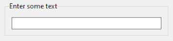
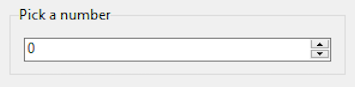
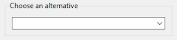
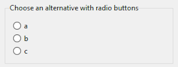
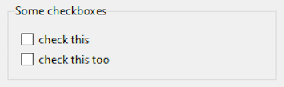
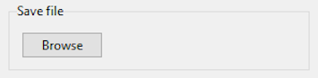
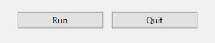

# `argui` - simple user interface for getting arguments.

`argsui` is like `argparse` but for graphical user interfaces. Some libraries like Gooey are designed to take an argparse command-line program and automatically convert it to a GUI program. The logic of `argui` is that it's much simpler to have an argparse branch and a GUI branch in the same program.

## Usage.

Download `argui.py` and dump it in the same folder as your program. Maybe there will be an installer at some point but this is just for me right now.

Then do the following:

1. Import it
    ```python
    import GUI from argui
    ```
2. Create the GUI object
    ```python
    g = GUI("My GUI")
    ```
3. Add widgets to the GUI
    ```python
    g.add(name1, value1)
    g.add(name2, value2)
    ...
    ```
    The kind of widget is usually inferred from the type of the value.
4. If needed, add actions to the GUI
5. Run it
    ```python
    g.run()
    ```
6. When it's finished, extract the argument values from the GUI object.
    ```python
    arg1 = g.get(name1)
    arg2 = g.get(name2)
    ```
    or
    ```python
    args = g.getvalues()
    ```
    where `args` is a dict of values keyed by the widget names.

---

## Widget Gallery.

In step 3 above, you add widgets to the GUI. The
widgets are **not** created at this point; that happens when you run the GUI. The signature of the `add` method is

```python
gui_object.add(name, values, id=None, init=None, type=None, **kwargs)
```

where

-   `name` is the name of the widget.
-   `values` is the values that the widget has initially.
-   `id` is an optional id for the widget. If not given, the widget id is the same as its name. You can use the widget id (or name0 to get or set the widget value.
-   `init` is the initial value for the widget, if needed and not the same as `values`.
-   `type` gives the type of the widget. Normally, the type of widget can be inferred from the type of the `values`. Supplying `type` overrides that inference.
-   `**kwargs` are arguments to pass to the Tk widget when it is created.

The widgets and their calling signatures are listed below, called on a GUI object `g`:

### 1. Text Entry

```python
g.add("Enter some text", "")
```

creates



-   `name` is the name of the labelled frame around the text entry widget
-   `value` is the initial value of the widget. Text values imply a text entry widget.

### 2. Numeric Entry

```python
g.add("Pick a number", 0, to=10)
```

creates



-   `name` is the name of the labelled frame around the spinner widget
-   `value` is the initial value of the widget. Numeric values imply a spinner.

### 3. Combobox/Dropdown

```python
g.add("Choose an alternative", ("a", "b", "c"))
```

creates



-   `name` is the name of the labelled frame around the combobox widget
-   `value` is a list or tuple of possible choices in the drop down box. List/tuple values imply a combobox.
-   `init`, if given, selects one of the choices

### 4. Radio buttons

```python
g.add("Choose an alternative with radio buttons", ["a", "b", "c"], type="radio")
# or
g.add("Choose an alternative with radio buttons", r("a", "b", "c"))
```

creates



-   `name` is the name of the labelled frame around the radio buttons
-   `value` is a list or tuple of radio button labels. Alternatively, you can `import
      r from argui` and use `r(...)` to create an object whose default
     type is radio.
-   `type` is `"radio"`. `type` is required when using a list or tuple, otherwise you'll get the combobox implied by the values.
-   `init`, if given, selects one of the radio buttons

### 5. Checkboxes in a group (frame)

```python
g.group("Some checkboxes")
g.add("check this ", False)
g.add("check this too", False)
g.group()
```

creates



In each checkbox `add`,

-   `name` is the label for the checkbox
-   `value` is the initial value `True` or `False`. Boolean values imply a checkbox.

This example also introduces a "group" or labelled frame. `g.group(name)` puts the
following `g.add` widgets in a labelled frame with label `name`. `g.group()` ends the frame.

### 6. A Save File widget

```python
g.add(
    "Save file",
    "",
    type="savefile",
    title="Save a csv or excel file",
    filetypes=(("CSV", "*.csv"), ("Excel", "*.xlsx")),
)
```

creates



-   `name` is the name of the frame around the widgets.
-   `value` is the file path to start with, if any.
-   `type` is one of `"openfile"`, `"openfolder"` or `"savefile"`. `type` is required here, otherwise you'll get a text entry box implied by the string value.

The keyword arguments after `type` are passed to the `filedialog.asksaveasfilename` dialog. If the dialog title is not given, it defaults to `name`.

---

### A Row of Buttons

```python
g.add('_buttons', ["Run", "Quit"], type="buttons")
# or
g.add('_buttons', [b"Run", b"Quit"])

```

creates



-   `name` is the name of the labelled frame around the radio buttons. If the name starts with an underscore, the labelled frame becomes just a frame (This is true in all the above cases too).
-   `value` is a list or tuple of button texts. A list or tuple of byte strings implies buttons.
-   `type` is required if the button texts are ordinary strings.

Using byte strings to trigger a set of button widgets is just because the `b` at the start of a byte string reminds me of button.

## Actions.

When you call `g.run()` you enter a tk event loop, so no further program is executed until that exits. To do anything while the GUI is running, you need to define actions for each of the widgets.

A GUI object creates a decorator method `g.on(name)` that connects a function to
the name of one of the widgets. When that widget changes value, the associated function is called.

For example,

```python
@g.on('Run`)
def onrun(name, value, gui):
    gui.root.destroy()
```

The callback `onrun` takes three arguments

-   `name` - the name of the widget whose value was changed
-   `value` - it's current value
-   `gui` - the gui object

In the body of the callback, `gui.root` is the window holding the gui. You can also attach a acllback with `g.on("Run", onrun)` where `onrun` is a function that has already been defined, or a lambda function.

There is a special event `"init"` that occurs immediately after `g.run()` is called. Use this event to configure the GUI widgets.

Note that each event can have only one callback. If you attach a different callback, that removes the original.
