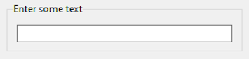
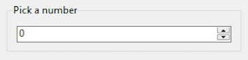
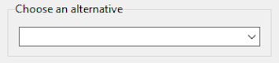
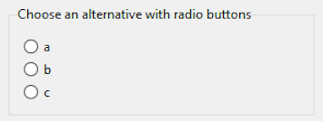
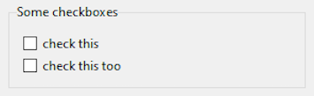
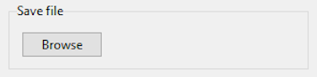
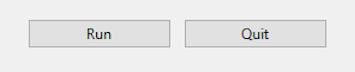

# `argui` - simple user interface for getting arguments.

`argsui` is like `argparse` but for graphical user interfaces. Some libraries like Gooey are designed to take an argparse command-line program and automatically convert it to a GUI program. The logic of `argui` is that it's much simpler to just target a GUI if that's what you want.

## Usage.

Download `argui.py` and dump it in the same folder as your program. Maybe there will be a pip installer at some point but not right now.

Then do the following:

1. Import it
    ```python
    import GUI from argui
    ```
2. Create the GUI object
    ```python
    g = GUI("My GUI")
    ```
3. Add widgets to the GUI
    ```python
    g.text_entry(name, value)
    g.dropdown(name, [choice1, choice2, ...])
    ...
    ```

4. If needed, add actions to the GUI
5. Run it
    ```python
    g.run()
    ```
6. When it's finished, extract the argument values from the GUI object.
    ```python
    arg1 = g.get(name1)
    arg2 = g.get(name2)
    ```
    or
    ```python
    args = g.getvalues()
    ```
    where `args` is a dict of values keyed by the widget names.

---

## Widget Gallery.

In step 3 above, you add widgets to the GUI. The
widgets are **not** created at this point; that happens when you run the GUI. The widgets and their calling signatures are listed below, called on a GUI object `g`:

### 1. Text Entry

```python
g.text_entry("Enter some text", "")
```

creates



#### Parameters:

-   `name` is the name of the labelled frame around the text entry widget
-   `value` is the initial value of the widget. Text values imply a text entry widget.

### 2. Numeric Entry

```python
g.numeric_entry("Pick a number", 0, to=10)
```

creates



#### Parameters:

-   `name` is the name of the labelled frame around the spinner widget
-   `value` is the initial value of the widget. Numeric values imply a spinner.

### 3. Combobox/Dropdown

```python
g.dropdown("Choose an alternative", ("a", "b", "c"))
```

creates



#### Parameters:

-   `name` is the name of the labelled frame around the combobox widget
-   `value` is a list or tuple of possible choices in the drop down box. List/tuple values imply a combobox.
-   `init` (optional) selects one of the choices

### 4. Radio buttons

```python
g.radio("Choose an alternative with radio buttons", {"a":False,  "b":False, "c":False})
```

creates



#### Parameters:

-   `name` is the name of the labelled frame around the radio buttons
-   `value` is a dict of radio button labels and values. 

You should only have one of the radio buttons set to True. If more than one, the last True button in the dict is checked.

### 5. Checkboxes in a frame

```python
g.checklist("Some checkboxes", {"check this ":False, "check this too":False})
```

creates



#### Parameters:

-   `name` is the name of the labelled frame around the check boxes
-   `value` is a dict of checkbox button labels and values. 


### 6. A Save File widget

```python
g.picker(
    "Save file",
    mode="savefile",
    title="Save a csv or excel file",
    filetypes=(("CSV", "*.csv"), ("Excel", "*.xlsx")),
)
```

creates



#### Parameters:

-   `name` is the name of the frame around the widget.
-   `mode` is openfile, savefile, or openfolder.
-   `id` (optional) an id if the name isn't unique or too verbose
-   `title` (optional) is the dialog box title
-   `filetypes` (optional) is the file types to pass to the dialog box.

Any other keyword arguments are passed to the `filedialog.asksaveasfilename` dialog. If the dialog title is not given, it defaults to `name`.

---

### A Row of Buttons

```python
g.buttons('_buttons', ["Run", "Quit"])
```

creates



#### Parameters:

-   `name` is the name of the labelled frame around the radio buttons. If the name starts with an underscore, the labelled frame becomes just a frame (This is true in all the above cases too).
-   `value` is a list or tuple of button texts. 
-   `layout` (optional) either row or column.


## Actions.

When you call `g.run()` you enter a tk event loop, so no further program is executed until that exits. To do anything while the GUI is running, you need to define actions for each of the widgets.

A GUI object creates a decorator method `g.on(name)` that connects a function to
the name of one of the widgets. When that widget changes value, the associated function is called.

For example,

```python
@g.on('Run`)
def onrun(name, value, gui):
    gui.root.destroy()
```

The callback `onrun` takes three arguments

-   `name` - the name of the widget whose value was changed
-   `value` - it's current value
-   `gui` - the gui object

In the body of the callback, `gui.root` is the window holding the gui. You can also attach a callback with `g.on("Run", onrun)` where `onrun` is a function that has already been defined, or a lambda function.

The name of the widget is the name parameter or id given when the widget is defined. The exception is buttons, where the name is the name of the button.

There is a special event `"init"` that occurs immediately after `g.run()` is called. Use this event to configure the GUI widgets.

Note that each event can have only one callback. If you attach a different callback, that removes the original.
